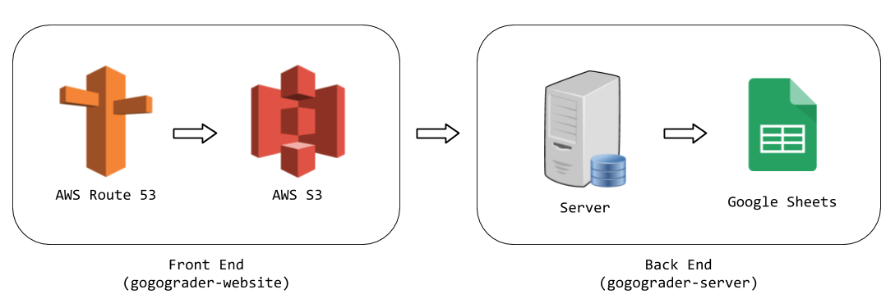

# GoGoGrader Website
The frontend to GoGoGrader, built with React.

## Entire Project Structure

## Quickstart
This project was built with [create-react-app](https://github.com/facebook/create-react-app). See [react.md](react.md) on how to run the website.

## Developing
If you are not familiar with [React](https://reactjs.org/) or [Redux](https://redux.js.org/), please understand how to use them before continuing on. 

This project also uses [React Router](https://reacttraining.com/react-router/web/guides/quick-start) for handling multiple pages, [Redux Thunk](https://github.com/reduxjs/redux-thunk) for state-driven API calls, and [Bootstrap](https://getbootstrap.com/) via [Reactstrap](https://reactstrap.github.io/) for website UI.

### File Structure
The structure is more or less a standard React Redux project structure. [This](https://medium.com/@dan_abramov/smart-and-dumb-components-7ca2f9a7c7d0) is a nice write-up on the difference between containers and components.

- `/public`: Some static elements of the website
  - `favicon.ico`: the small website icon on the browser
  - `index.html`: Autogenerated index page, do not touch
  - `manifest.json`: Not sure what this is for really
- `/src`: The main project code
  - `index.js`: Where the code starts. Do not add anything beyond global initialization and setup, put the website structure code for `containers/Root.js`
  - `/actions/index.js`: Redux actions
  - `/components`: React components focused on "how things look". They tell the website how it's layed out and pass on user input to containers
    - `Header.js`: Website header
    - `LoginDialogue.js`: The center panel in the login screen
    - `WorksheetChooser.js`: Where students can select their worksheet level and page to work on
    - `WorksheetProblems.js`: One worksheet page listing all the problems on the worksheet and the bottom bar
    - `WorksheetTitle.js`: Shows the worksheet level and page above the worksheet problems
  - `/containers`: React components focused on "how things work". They interface with Redux and make API calls and handle the logic part of the website
    - `HomePage.js`: The fake home page, just redirects to the worksheet chooser if logged in
    - `LoginPage.js`: The login page of the website
    - `Root.js`: Where the central routing and layout logic of the website goes
    - `WorksheetChooserPage.js`: Page for choosing your level and page to work on
    - `WorksheetPage.js`: Page for displaying a page of the selected worksheet
  - `/reducers/index.js`: Redux reducers
  - `/styles`: Where the style sheets are kept. Each .scss file corresponds with the .js file of the same name

### Deploying
Run `yarn run build` to build a static version of the website, and then upload the contents of the newly created `/build` directory (the contents, but not the directory itself) into your S3 Bucket. Make sure that the S3 Bucket is set to static website hosting with both the index and the error document being `index.html`.
